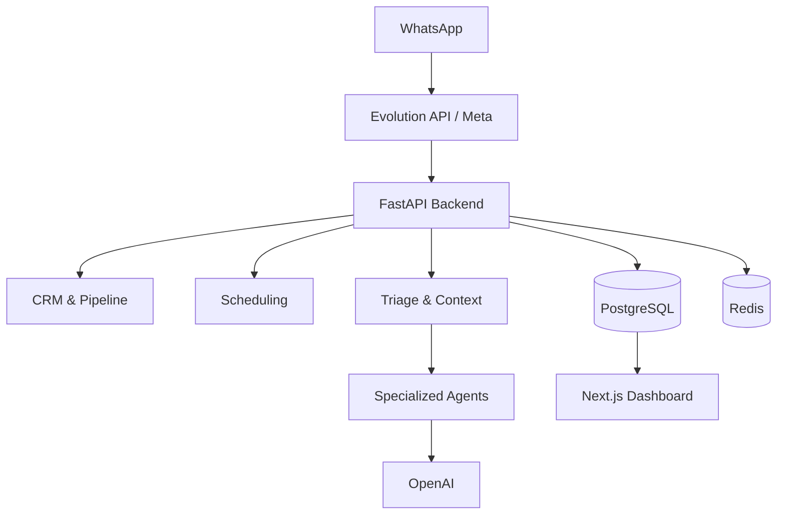

# AgenteGo: AI-Powered Customer Service & CRM SaaS

**AgenteGo** is a multi-tenant SaaS platform built to automate customer service, qualify leads, and manage sales pipelines using AI. The system was developed and validated through real-world client usage and operational testing.

This project demonstrates end-to-end system development—from translating operational bottlenecks into technical requirements, to architecting and deploying a complete hardware/software integration.

---

## 1. Business Problem & Systems Design
Local businesses (such as gyms and real estate agencies) struggle with lead leakage and slow response times on WhatsApp. Manual customer service often results in high response times outside business hours, disorganized tracking of lead status, and lost revenue.

To solve this, I designed a solution that bridges the gap between communication and CRM, ensuring no lead is dropped.

**Key Business Analysis Decisions:**
- **Dynamic Custom Fields:** Different customers require different qualification fields. Instead of hard-coding every workflow, I designed configurable custom fields that can be added per tenant and incorporated directly into the AI context (validated via `test_triage_custom_fields.py`).
- **Multi-Tenancy as a Core Concept:** The system was built from day one to serve multiple isolated companies. The `tenant` entity isolates leads, events, CRM data, and AI configuration, providing a true scalable SaaS architecture.

## 2. System Architecture & Data Modeling
The system uses a decoupled architecture to ensure scalability and ease of maintenance, with a clear abstraction layer for the WhatsApp provider:

- **Integration Abstraction:** The integration layer is abstracted (`app/whatsapp/base.py`, `dispatcher.py`), allowing seamless switching between Evolution API and official Meta APIs without rewriting business logic.
- **Data Persistence & Schema Evolution:** **PostgreSQL** handles the relational data model. The system evolved incrementally through schema migrations (via **Alembic**) as new business capabilities and integration requirements were introduced.

## 3. Advanced Operational Features
- **Deterministic Human Handoff:** The AI does not control everything. There is a strict deterministic business rule around it. If the AI detects frustration or a complex request, it pauses itself and notifies a human agent (using explicit tags like `[SOLICITAR_HUMANO]`), ensuring a safe fallback.
- **Smart Re-engagement:** Automated customer re-engagement workflows with configurable multi-step cadences, delays, and anti-spam guardrails (validated via `test_smart_reengagement.py`).

## 4. Implementation & Quality Assurance
The application features rigorous automated testing to ensure reliability during business-critical workflows.

- **Testing Strategy:** Developed tests using mocks for external services (OpenAI, WhatsApp, external calendars) to execute and document application and system tests (e.g., `test_agenda.py`, `test_multiagents.py`, `test_whatsapp_agenda.py`).
- **Security:** Security mechanisms implemented include JWT authentication, bcrypt password hashing, tenant data separation, rate limiting, and webhook validation.
- **Deployment:** The ecosystem is containerized using **Docker** and orchestrated via `docker-compose`.

## Screenshots

### The Admin Dashboard

*Centralized view of AI metrics, active conversations, and system health.*

### CRM & Pipeline Management

*Visual sales funnel automatically updated by the AI based on conversation outcomes.*

### AI Configuration

*Dynamic tenant configuration where users can adjust business rules, pricing, and AI persona.*

---

## Technical Stack Summary
- **Backend:** Python, FastAPI, SQLAlchemy, Alembic, PostgreSQL, Redis.
- **Frontend:** Next.js, React, TypeScript, TailwindCSS.
- **Integrations:** OpenAI API, Evolution API (WhatsApp).
- **DevOps/QA:** Docker, Pytest, Bash Scripting.
