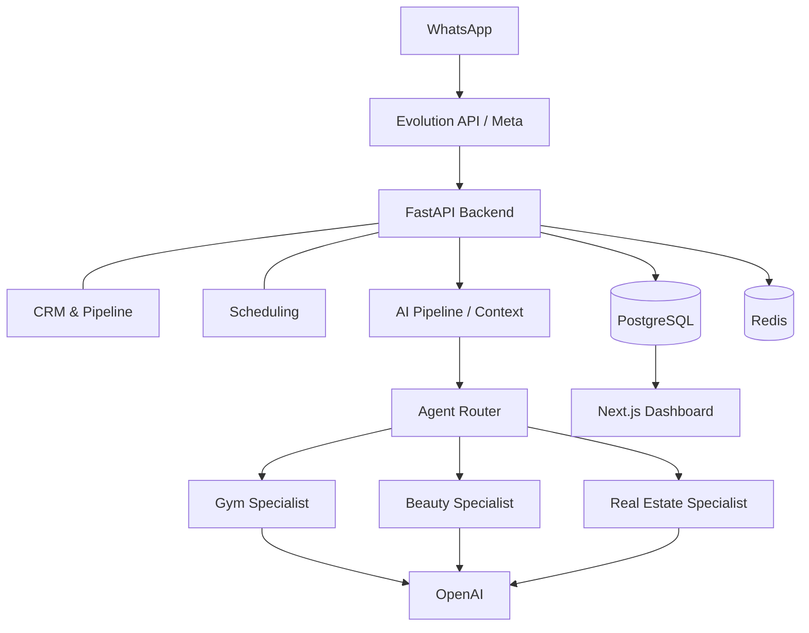
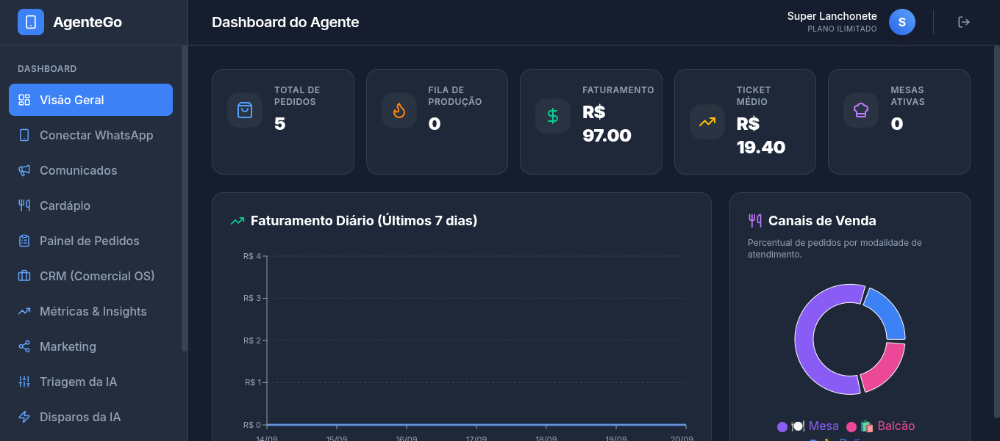
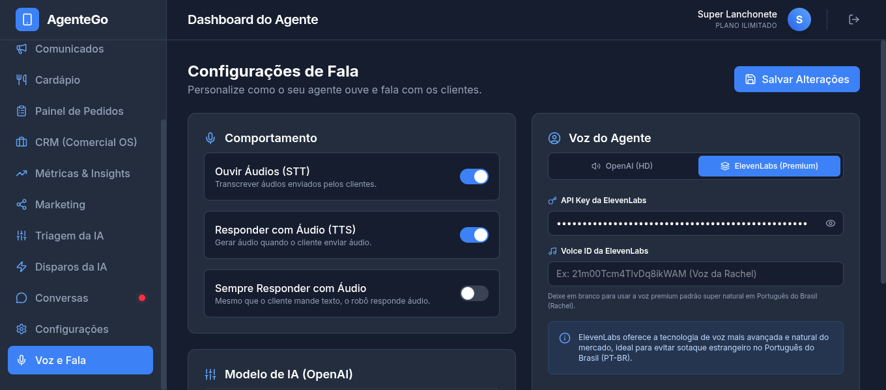
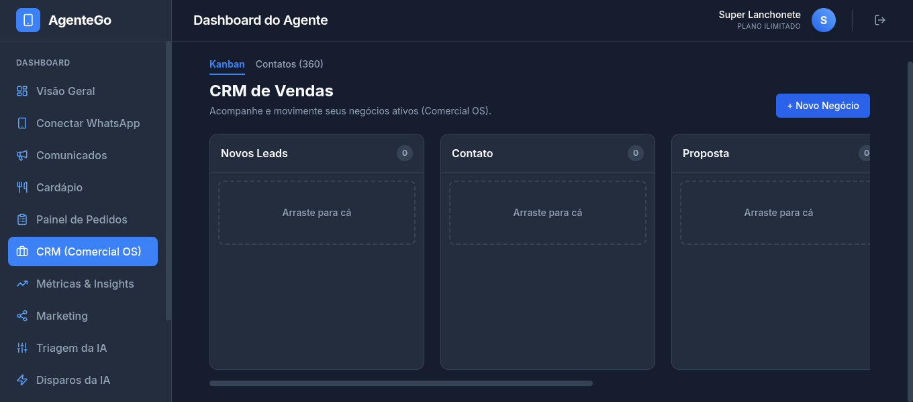

# Agente Go

## 1. Overview
Agente Go is a multi-tenant SaaS platform built to automate customer service, qualify leads, and manage sales pipelines using AI. This repository contains the core services connecting WhatsApp (Evolution API), a FastAPI AI processing backend, a PostgreSQL relational database, and a Next.js admin dashboard.

Project development: 2025–2026

For detailed technical documentation, please refer to the `docs/` folder:
- [Architecture Details](docs/architecture.md)
- [Requirements & Design Decisions](docs/requirements.md)
- [Testing & Validation](docs/testing.md)

## 2. The Problem
Local businesses (such as gyms and real estate agencies) struggle with lead leakage and slow response times on WhatsApp, their primary communication channel. Manual customer service often results in high response times outside business hours, disorganized tracking of lead status, and inconsistent communication leading to lost revenue.

## 3. The Solution
I designed a modular multi-tenant platform that bridges the gap between customer communication and CRM. The system intercepts WhatsApp messages, passes them through a specialized AI triage pipeline, qualifies the lead, schedules appointments, and updates a visual CRM funnel.

## 4. Key Features
- **Multi-tenant Architecture:** Isolated environments for different businesses on the same infrastructure.
- **Dynamic Custom Fields:** Configurable data extraction points tailored to each tenant's specific needs.
- **Deterministic Human Handoff:** Strict business rules allowing the AI to transfer complex conversations to a human operator.
- **Smart Re-engagement:** Automated, multi-step follow-up cadences with anti-spam safeguards.
- **Domain-Specific Agents:** Specialized AI behaviors configured for different industries (Gym, Beauty, Real Estate).

## 5. Architecture

## 6. Technology Stack
- **Backend:** Python, FastAPI, SQLAlchemy, PostgreSQL, Redis, Alembic.
- **Frontend:** Next.js, React, TailwindCSS.
- **Integrations:** OpenAI API, Evolution API.
- **DevOps/QA:** Docker, Docker Compose, Pytest.

## 7. Business & System Requirements
| Business Requirement | System Solution |
|---|---|
| Different businesses require different workflows | Multi-tenant architecture |
| Each business needs different qualification info | Configurable custom fields |
| Some conversations require human intervention | Deterministic human handoff workflow |
| Different industries require different behavior | Specialized modular agents |
| Customers need appointment scheduling | Integrated scheduling module |
| Automated follow-up must avoid spam | Configurable re-engagement with safeguards |

## 8. Testing & Validation
The project includes automated tests covering multi-agent behavior, customer triage, custom fields, scheduling workflows, WhatsApp integration, automated re-engagement, and domain-specific agents. See [Testing Documentation](docs/testing.md) for details.

## 9. Deployment
The system is fully containerized. A `docker-compose.yml` file is provided to orchestrate the backend, frontend, database, and caching layers securely.

## 10. Project Status
The platform has been developed and validated through real-world operational scenarios. Some components are actively used/tested, while others represent ongoing product development and future expansion. This repository contains the technical implementation and documentation of the project.

## 11. Screenshots

### Dashboard Overview

*Centralized interface for monitoring AI-assisted customer interactions and transferring conversations to human operators when required.*

### AI Configuration

*Dynamic tenant configuration where users can adjust business rules, pricing, and AI persona.*

### CRM Pipeline

*Visual sales funnel automatically updated by the AI based on conversation outcomes.*

### Architecture

*Visual representation of the system components.*

## 12. My Role
I designed and developed the platform, including:
- Translated operational requirements into system workflows and technical solutions
- Designed business rules and validation flows
- Defined and tested system behavior for different business scenarios
- Iteratively evolved the system based on operational requirements
- Backend architecture and REST APIs
- Database modeling
- AI agent orchestration
- WhatsApp integrations
- CRM and scheduling workflows
- Multi-tenant architecture
- Frontend/dashboard
- Automated tests
- Docker-based deployment

## 13. Architecture Decisions
- **Why FastAPI?** For asynchronous APIs and seamless integration with the Python/AI ecosystem.
- **Why PostgreSQL?** Relational persistence for structured data across multiple isolated tenants.
- **Why Redis?** Buffering, caching, and processing specific background tasks (like anti-spam and debouncing).
- **Why modular agents?** To allow specific behavior per domain without duplicating the core architecture.
- **Why multi-tenancy?** To allow the same platform infrastructure to securely support different companies.

## 14. Limitations & Future Work
Current development areas include:
- expanding automated test coverage;
- improving observability and monitoring;
- expanding WhatsApp provider support;
- further hardening tenant isolation;
- performance/load testing;
- expanding documentation.
