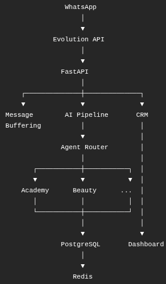

# AgenteGo: AI-Powered Customer Service & CRM SaaS

**AgenteGo** is a multi-tenant SaaS platform built to automate customer service, qualify leads, and manage sales pipelines using AI. This project demonstrates end-to-end system development—from translating operational bottlenecks into technical requirements, to architecting and deploying a complete hardware/software integration.

---

## 1. Business Problem
Local businesses (such as gyms and real estate agencies) struggle with lead leakage and slow response times on WhatsApp, their primary communication channel. Manual customer service often results in:
- High response times outside business hours.
- Disorganized tracking of lead status and sales opportunities.
- Inconsistent communication and lost revenue.

## 2. Requirements & Solution Definition
After gathering operational requirements and mapping the typical sales funnel for these niches, I designed **AgenteGo** to bridge the gap between communication and CRM.

**Key Requirements:**
- **Automated Triage:** 24/7 AI-driven responses capable of answering FAQs and capturing lead data.
- **Human Fail-Safe:** A seamless transition protocol to human agents for complex requests.
- **Centralized Data:** A unified dashboard to track metrics, manage the CRM pipeline, and adjust AI behavior.
- **Multi-Tenancy:** A scalable architecture to support multiple clients securely within the same infrastructure.

## 3. Architecture & Data Modeling
The system was designed with a decoupled architecture to ensure scalability and ease of maintenance:

- **Integration Layer:** Utilizes Evolution API to handle real-time WhatsApp webhooks.
- **AI Processing (Backend):** Built with **FastAPI** (Python) and integrated with the **OpenAI API**. It evaluates intent, handles context, and interacts with the CRM.
- **Data Persistence:** **PostgreSQL** handles the relational data model (Tenants, Users, CRM Contacts, Pipelines, Deals, and AI Context). SQLAlchemy is used for ORM and Alembic for database migrations.
- **User Interface (Frontend):** A responsive dashboard built with **Next.js** and **React**, allowing business owners to monitor real-time chats, sales pipelines, and tweak their AI Agent's rules (pricing, tone of voice, etc.).

*(Below: High-level architectural flow)*

## 4. Implementation & QA
- **Deployment & Orchestration:** The entire ecosystem is containerized using **Docker** and orchestrated via `docker-compose`, ensuring environment parity between development and production.
- **Security & Reliability:** Implemented automated database backups (with off-site sync to Backblaze B2) and robust environment variable management.
- **Quality Assurance:** 
  - Designed automated fallback mechanisms: if the AI detects frustration or a request outside its scope, it pauses itself and notifies a human agent via the dashboard.
  - Comprehensive logging and webhook monitoring to trace and resolve integration issues quickly.

## 5. Results & Business Impact
By deploying AgenteGo, businesses transform their customer acquisition process:
- **Response Time:** Reduced from hours to seconds (instant 24/7 engagement).
- **Operational Efficiency:** Automates up to 80% of top-of-funnel inquiries, allowing human teams to focus exclusively on closing high-value deals.
- **Data-Driven Decisions:** The integrated CRM ensures no lead is dropped, increasing overall conversion rates.

---

## Screenshots & Walkthrough

### The Admin Dashboard

*Centralized view of AI metrics, active conversations, and system health.*

### CRM & Pipeline Management

*Visual sales funnel automatically updated by the AI based on conversation outcomes.*

### AI Configuration

*Dynamic tenant configuration where users can adjust business rules, pricing, and AI persona.*

---

## Technical Stack Summary
- **Backend:** Python, FastAPI, SQLAlchemy, PostgreSQL.
- **Frontend:** Next.js, React, TailwindCSS.
- **Integrations:** OpenAI API, Evolution API (WhatsApp).
- **DevOps:** Docker, Docker Compose, Bash Scripting.
